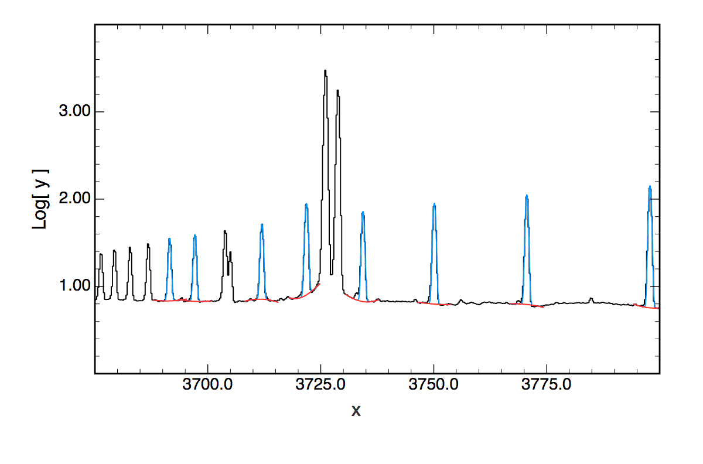

5 Auxillary MAPPINGS Programs
=============================

command: blur
-------------

Convolve a single flambda spectrum or a spectrum and continuum and make
a normalised spectrum - even if both spectra are very different
resolutions or ranges. Start end and Delta Lambda bins can be set plus
velocity, gaissian or box or rotation convolution are possibe.

Reads terminated lines (classic mac), and lines (linux, unix, OSX), as
well as PC + lines.

Reads txt.gz or .txt plain files.

Build
~~~~~

To build the ``blur`` command:

::

     1) >cd blur/

     2) >make

     3) >make clean

Install
~~~~~~~

::

     4) >make install

Uninstall
~~~~~~~~~

::

     5) >make uninstall

Usage:
~~~~~~

::

     > ~/mappings520/bin/blur

for the useage info:

Useage: blur [-s] [-d dlambda][-l headerlines] [-n min lambda] [-m
maxlabda] [-r resolvePower] [-f fwhm] [-v vsini] flux25file cont25file

::

     Args: optional -s use single spectrum - no normalising continuum
           optional resolvePower: positive float, lambda/dlambda
           optional  fwhm: gaussian positive float, km/s
           optional vsini: rotation positive float, km/s
           if -r -f -v are omitted or all <= 0.0, no convolution is performed
           default 3300.25, wave optional min -n minwave
           default 8934.25, wave optional max -m maxwave
           default 0.25 A -d dLam, optional output bin resolution
           default 7 header lines -l lines optional  and then two columns
   Required: Input files can be text or text.gz files
           lambda <3295.0A >9005.0A 0.25A bins
           Lambda   Flambda
   Output: lambda 3300.0A - 9000.0A 0.25A bins
           lambda, flux, continuum, normalised flux
           suitable as a 4 column csv file

Convolve, Rebin and Normalise Result with Continuum
~~~~~~~~~~~~~~~~~~~~~~~~~~~~~~~~~~~~~~~~~~~~~~~~~~~

If -s is not used and two spectra are specified, the second is the
continuum, often the MAPPINGS model. Divide convolved and resampled
contiuum into the same convolved and resampled range. Output is a new
binned spectrum, spec, cont, normalised spectrum as a 4 column .csv file
with continuum = 1.0.

::

   > blur -r 6800.0 -l 4 fluxfile contfile

takes fluxfile with 4 header lines and contfile with 4 header lines and
creates a R6800 spectrum fro 3300-8950A matching a WiFes spectrum with
0.25A bins.

Single Spectrum Convolve and Resample
~~~~~~~~~~~~~~~~~~~~~~~~~~~~~~~~~~~~~

If -s is used and one spectra is specified, the continuum is not used.
The spectrum is convolved and resampled as above. Output is new binned
spectrum, spec, spec, and constant column = 1.0 everywhere as a 4 column
.csv file in the same format as the first mode, but without a model
continuum.

::

   > blur -s -f 50.0 -l 7 fluxfile

Convolves and rebins a 7 header line file of any resolution to 0.25A
bins and 3300-8950A matching a WiFes spectrum, convolved with a 50.0
km/s gaussian.

command: lines
--------------

A nebula line list fitting command line utility *lines* is for text file
based, command–line, gaussian line fitting. An input list of spectral
patches is used to measure lines in a simple two column text file
spectrum.

Output is as simple text, suitable for creating csv files in subsequent
use.

Useage:
~~~~~~~

::

    lines: Spectral line measurements.
    Useage: lines [-c -d -s subFile -p n[:m] -b n[:m] -r n[:m]] -l patchList [-n nlines ] spectrumFile
      Args: required: -l patchList (see example list.txt for format)
            required: spectrumFile, two cols, wavelength - flambda
                      file can be text or text.gz file
                      n header lines (default 0) and then two columns:
                      Lambda  Flambda\n\n");
            optional: -n number of header lines in spectrumfile, default 0
            optional: -r n or -r n:m print output for just line #n or lines #n:m
            optional: -c output the continuum quadratic coefficients, a, b, c: a + bx + cx^2
            optional: -s output the spectrum with all gaussian lines subtracted, leaving residual continuum
            optional: -p n or -p n:m print out line fit +/- 3FWHM,
                       for line #n or #n to #m, -p 0 for all lines
            optional: -f as p but prinout each line fit over full patch, not just  +/- 3FWHM
            optional: -b as p but with patch centred on the line
            optional: -d output debugging information - especially to renumber patches
    Output: std out line fits suitable for csv/text file, redirect to a csv filename for example

lines Useage Options
~~~~~~~~~~~~~~~~~~~~

-  The spectrum and/or the line list files may be gzipped or not, output
   is alway uncompressed.

-  spectrum file name must be the last argument

   ::

        -l patchList        The file that lists all patches to measure,
                            patches outside the range of the spectrum are ignored.

        -s subFile         output a spectrum into subFile with all gaussian lines subtracted,
                           leaving just continuum data, patch continuua are not subtracted.

        -r n or -r n:m     print output for just line #n or lines #n to m inclusive
                           uses line number as shown in the output list, __NOT__ patch numbers
                           useful to limit output to a few problem lines while adjusting the patch file.

        -d                 output debugging information - printing warnings,
                           and printing out the patches as the code read them,
                           very useful to clean and renumber patch files that are becoming messy

        -p n or -p n:m     print out full line fits for line #n or #n to #m, use 0 for all lines
                           uses line number as shown in the output list, __NOT__ patch numbers.
                           Prints the just the region within 3 FWHM of the line centre for each line.

        -f                 Same as p but with printout over full patch. not just +/- 3FHWM

        -b                 Same as p but with coordinates centred on the line centre

        -n                 number of header lines in spectrumfile to skip over,
                           default 0, optional

        -c                 output the continuum quadratic coefficients,
                           a, b, c: a + bx + cx^2, otional

.. _build-1:

Build
~~~~~

::

     > make build

command: listlines
~~~~~~~~~~~~~~~~~~

In addition a utility called ``listlines`` that reads a patch file and
lists it as a table or as a renumbered patch file is made at the same
time:

::

    listlines: Tabulate a summary of a patchfile
      Useage: listlines [-d] patchList
          Args: required: patchList (see example list.txt for format)
                optional: -d re-output as patches - especially to renumber patches
        Output: std out line fits suitable for csv/text file, redirect to a csv filename for example

listlines Useage Options
~~~~~~~~~~~~~~~~~~~~~~~~

-  patchlist file name must be the last argument

   ::

        -d                 output debugging information -
                           printing out the patches as the code read them,
                           and renumbering the patches.  Applies global settings
                           and writes the equivalent individual patches generated
                           - useful for checking global resolution

Basic lines Examples
~~~~~~~~~~~~~~~~~~~~

eg

::

   > lines -l list.txt spectrum.txt

or

::

   > lines -l list.txt spectrum.txt > output.csv
   > open output.csv

to save the output and open it with an app, say Excel or other
spreadsheet.

To plot the solutions over the original spectrum, save the patch fit
details with ``-p 0`` to a file and plot with your favourite plotter, eg
Graf.

::

   > lines -p 0 -l list.txt  spectrum.txt > solutions.txt

then open spectrum.txt and solutions.txt with the plotter and plot…

   Spectrum with Solutions overplotted.

To get a copy of the spectrum with the fitted lines removed, use -s to
specify the new file name;

::

   > lines -s subtracted.txt -l list.txt  spectrum.txt > solutions.txt

then open spectrum.txt and subtracted.txt and plot to compare.

Line measurement line target list format
~~~~~~~~~~~~~~~~~~~~~~~~~~~~~~~~~~~~~~~~

The spectrum is divided into patches, each patch has a left and right
continuum region, which is fit and subtracted before one or more
gaussian components are fit.

Residual RMS is computed after subtracting the line and continuum fit
from the patch and averaging over 3×FWHM centred on the line centre, and
ratiod with the line peak in the output.

Covariance values of 1 sigma for the gaussian height and width
coefficients, and the continuum constant coefficient 1 sigma, are added
in quadrature to get an estimate of the 1 sigma uncertainty in the line
total flux, expressed as a percentage of the total flux in the output.

The line list is made of ``keyword = value`` pairs and any number of
comment and blank lines. Keywords can appear in any order, and can be
grouped for convenience.

Ranges are denoted with a colon, ie ``-1.00:3.00`` is a range from -1 to
+3 comments are protected with a # character in any line

Keywords:
~~~~~~~~~

Keywords are CaSe sensitive!

The input patch list file is a commentable list of keywords and values,
as a plain text file. The keywords are case sensitive. Keywords can
appear in any order. ``#`` characters comment to the end of the line
they eppear in.

lines will scan the patch list file for as many patches as it can find.
Each used the number in the file as an ID number:
patchNumber.lineNumber, eg 004.01 is patch 4 line 1. when actually read
in not all patch numbers may or need be present, patch 003 may be
missing. The code will take the lines in increasing order as found. Use
the -d option to create output that renumbers the patches back to
starting with 001 and increasing in order.

A patch is found when at a minimum a ``Patch_XXX_Line`` or
``Patch_XXX_nLines`` keyword is found. The other keywords for the patch
are then searched for, and default values are used for any missing
information.

So the minimum patch (and minimum entire patchFile) is like this, an
approximate wavelength and an estimated width:

::

       Patch_001_Line   = 3697:0.7

There are many more keywords available to control the continuum
selection, masking, fitting order, and deblending options for patches
with multiple close lines.

Once all the patches that can be found are read, the code looks for each
one in the spectrum, and lists the results for each line found in the
patches, counting the lines in the output, and noting which patch they
came from so they can be traced back to the patch list if needed.

Keywords for All Patches:
~~~~~~~~~~~~~~~~~~~~~~~~~

There are a couple of global keywords that allow defaults to be set, to
use if a patch doens’t specify a parameter explicitly:

::

       Global_Order   = n         # n = 0, 1, 2, order of fit to use unless overridden in a patch

       Global_Width   = width     # width of a line to use if not specified, ie
                                  # if  Patch_XXX_Line   = centre  and no width paramter is used, not
                                  # recommended unless desperate. :)

       Global_Resolution = res    #  res > 0.0, preferably equal to the instrumental, eg 5000.0
                                  # if  Patch_XXX_Line   = centre  and no width paramter is used,
                                  # a width is computed from the resolving power,
                                  # width = centre/res, assuming the real line
                                  # is unresolved, eg in HII regions.

These keywords are optional and can be left out. Order defaults to 2,
Width to 1.0 and resolution is set to 0.0 so that if it is not specified
and a patch line is incomplete an error will occur.

Keywords for each Patch:
~~~~~~~~~~~~~~~~~~~~~~~~

-  Within a patch there can be either a single line, as a range:

   ::

        Patch_XXX_Line   = centre:width

   The centre and width can be approximate, accurate enough only to get
   the algorithm to converge initially. the line number is 01
   implicitly, so the line id will be XXX.01. This scheme works best if
   the intial line centre estimate is accurate within ± a single
   spectrum resolution bin

-  or, a list of lines for the patch using an optional ``nLines``
   keyword for the number of lines to find in the patch.

   ::

        Patch_XXX_nLines  = nl  #  (nl > 0)
        Patch_XXX_Line_00 = centre:width
        Patch_XXX_Line_01 = centre:width
                      ....
        Patch_XXX_Line_NL = centre:width

   for line ``NN`` of patch ``XXX``, etc the line ID will be XXX.NL,
   leading zeros are kept.

The continuum region can be specified:

-  If the line is isolated and surrounded by good continuum, all that is
   needed is the initial line centre and a line FWHM value, and *lines*
   will assume the continuum starts at -5 FWHM to -2.5 FWHM and then
   again at 2.5 FWHM - 5 FWHM, either side of the line centre. In this
   case a line is specified simply as:

   ::

          Patch_XXX_Line    =  centre:width

Note, it is important to check the fit (use the ``-p [n [:m] | 0 ]``
option to print the solutions )

-  If the line has a more complex patch then you should manually specify
   the left and right continuum regions:

   ::

          Patch_XXX_Left    = l0:l1  # range of left continuum area in patch XXX (include leading 0s)
          Patch_XXX_Right   = r0:r1  # of right continuum area in patch XXX (include leading 0s)

   This is the preferred method, and the regions should be wide enough
   to cover several or more spectrum points each, and can even be quite
   far from the target line if necessary. Use the range limits to avoid
   fitting nearby lines or spectrum defects, where the automatic
   continuum specifiction above can fail.

-  If the left and right continuum regions are specified with a single
   number, not a range:

   ::

          Patch_XXX_Left    = l0  # left continuum point patch XXX
          Patch_XXX_Right   = r0  # right continuum point patch XXX

   or the ranges will only cover one spectrum point each, a linear
   continuum fit, a straight line between l0 and r0 will be used instead
   of a quadratic fit.

-  A linear fit can be forced even with a range of continuum with the
   ``Order`` keyword:

   ::

          Patch_XXX_Order   = 1      # order of continuum fit override, 0 = const (fit), 1 = linear, 2 or more quadratic

-  If the patch specifies a constant continuum value, this value is
   simply subtracted and only the line is fit over a patch ±1 FWHM, or
   over the Left and Right ranges if specified.

   ::

          Patch_XXX_Continuum = value  # continuum constant for entire patch XXX, *not fit*, order = 0

-  If the patch specifies a constant continuum *range*, this value is
   simply subtracted and only the line is fit over a patch. The
   continuum range is given as the estimated continuum at the left and
   right limts of the patch, or at ±1 FWHM if no patch limits are given

   ::

          Patch_XXX_Continuum = leftValue:rightValue   # continuum constant+  linear slope for entire patch XXX, *not fit*, order = 1

-  If the patch part of the patch contains a bad region, those points
   can be excluded with a mask region.

   ::

          Patch_XXX_Mask = m0:m1  # range of masked points, must be a range not a single point

*lines* will find the nearest data points to the ranges given in an
inclusive way.

Examples:
~~~~~~~~~

A single line patch, auto continuum selection,
^^^^^^^^^^^^^^^^^^^^^^^^^^^^^^^^^^^^^^^^^^^^^^

::

      # Balmer line
      Patch_001_Line   = 3750.0:0.7

A single line patch, manual continuum ranges, quadratic continuum fit,
^^^^^^^^^^^^^^^^^^^^^^^^^^^^^^^^^^^^^^^^^^^^^^^^^^^^^^^^^^^^^^^^^^^^^^

::

      # High Balmer line quadratic continuum
      Patch_001_Left   = 3689.0:3689.5
      Patch_001_Right  = 3693.5:3694.0
      Patch_001_Line   = 3691.5:0.5

A single line patch, manual continuum ranges, linear continuum fit,
^^^^^^^^^^^^^^^^^^^^^^^^^^^^^^^^^^^^^^^^^^^^^^^^^^^^^^^^^^^^^^^^^^^

::

      # High Balmer line - linear continuum
      Patch_001_Left   = 3689.0
      Patch_001_Right  = 3694.0
      Patch_001_Line   = 3691.5:0.5

A single line patch, constant continuum, for most difficult fits
^^^^^^^^^^^^^^^^^^^^^^^^^^^^^^^^^^^^^^^^^^^^^^^^^^^^^^^^^^^^^^^^

::

      # High Balmer line - fixed continuum
      Patch_001_Line   = 3691.5:0.5
      Patch_001_Continuum  = 5.0

Multiple lines in a patch, with auto continuum
^^^^^^^^^^^^^^^^^^^^^^^^^^^^^^^^^^^^^^^^^^^^^^

::

      #
      # [OII] doublet
      #
      Patch_001_nLines  = 2
      Patch_001_Line_01 = 3726.0:0.7
      Patch_001_Line_02 = 3729.0:0.7

Multiple lines in a patch, with manual continuum
^^^^^^^^^^^^^^^^^^^^^^^^^^^^^^^^^^^^^^^^^^^^^^^^

::

      #
      # [OII] doublet
      #
      Patch_001_Left    = 3723:3724.5
      Patch_001_Right   = 3730.5:3733
      Patch_001_nLines  = 2
      Patch_001_Line_01 = 3726.0:0.7
      Patch_001_Line_02 = 3729.0:0.7

A single line patch, manual continuum ranges, masking out a subrange!,
^^^^^^^^^^^^^^^^^^^^^^^^^^^^^^^^^^^^^^^^^^^^^^^^^^^^^^^^^^^^^^^^^^^^^^

::

      # Paschen Line
      Patch_001_Left  = 8308.0:8312.0
      Patch_001_Right = 8316.5:8318.0
      Patch_001_Mask  = 8310.0:8312.5 # mask out a dip
      Patch_001_Line  = 8314.1:1.4

Optional Advanced keywords:
'''''''''''''''''''''''''''

When deblending lines it is sometimes helpful to fix the width and/or
the line centres of the lines in a patch. The algorithm always solves
for the peak height.

To fix the widths, add:

::

       Patch_XXX_Fixed_Widths = 1  # >0 fixed, 0 free

to a patch group. Any integer > 0 with cause the widths to be fixed –
the line widths are then held constant in the solutions. To free the
widths set ``Fixed_Widths`` to 0 or delete it:

::

       Patch_XXX_Fixed_Widths = 0

To fix the centres, add:

::

       Patch_XXX_Fixed_Centres = 1  # >0 fixed, 0 free

to a patch group. Any integer > 0 with cause the centres to be fixed –
the line widths are then held constant in the solutions. To free the
centres, set ``Fixed_Centres`` to 0, or delete it:

::

       Patch_XXX_Fixed_Centres = 0

Fixed Widths and Centres can be set both or either independently.

Note ‘Centers’ in keywords works as well as ‘Centres’ :)

Gaussian or Lorentzian
~~~~~~~~~~~~~~~~~~~~~~

The default patch line fitting option is to fit gaussian line profiles.
The keyword:

::

       Patch_XXX_Lorentz = 1  # >0 fit Lorentzians instead, 0 don't

Changes all the lines in a patch to be fit with Lorentzian profiles
instead. The Lorentzian profile is numerically less stable when fitting
than a Gaussian profile, so more care is needed with the initial
estimates of parameters and fixing of centres and or widths is also
commonly needed. Check the resulting fit carefully!

Future versions will allow mixing of Lorentzians and Gaussians in a
single patch.

command: red
------------

redden or de-redden a spectrum or line list in a text file
~~~~~~~~~~~~~~~~~~~~~~~~~~~~~~~~~~~~~~~~~~~~~~~~~~~~~~~~~~

Reads terminated lines (classic mac), and lines (linux, unix, OSX), as
well as PC + lines.

Reads txt.gz or .txt plain files.

(NOTE) Default header lines is now 1, not 7
^^^^^^^^^^^^^^^^^^^^^^^^^^^^^^^^^^^^^^^^^^^

.. _build-2:

Build
~~~~~

To build the ``red`` command:

::

     1) cd red/

     2) make

     3) make clean

.. _install-1:

Install
~~~~~~~

::

     4) sudo make install

.. _uninstall-1:

Uninstall
~~~~~~~~~

::

     5) sudo make uninstall

.. _usage-1:

Usage:
~~~~~~

::

     >red

for the useage info:

::

     Useage: red [-r Rv] [-c Cn] [-t typeID] [-n skip ] flux25file

     Version: 1.0.0
     Args: optional Rv: AV/E(B-V) > ~2
                      if -r omitted Rv = 3.1

          optional  Cn: Nebula Reddening Constant
                     if -c omitted Cn = 1.0
                     if Cn < 0.0 then deredden

          optional  Scale: Flux Scale Factor > 0.0
                     if -s omitted Scale = 1.0

          optional  typeID: Reddening Function
                     0: CMM89 Stellar Al/Av (default)
                     1: B07 Orion modified CMM89
                     2: F99 Fitzpatrick Al/E(B-V)
                     3: FM07 Fitzpatrick & Massa E(l-V)/E(B-V)
                     4: C00 Calzetti Extinction k(l)
                     5: FD05 Fischera Av=1.0 extinction
                     6: P70 Piembert Rv5.5 Orion Only
                     7: VCG04-14 UV ONLY Modified CMM89

          optional  skip: Input header lines to skip,
                      Defaults to 1 line, use 7 for CMFGEN files

          Required: Input file can be text or text.gz file
                    Default 7 header lines and then two columns
                    Lambda   Flambda
                    or same but with just a 2 column list:
                    LineLambda   flux

          Output: to stdout: lambda, flux, reddened flux, F(l)...
                   suitable as a 7 column csv file

To de-redden a line list
~~~~~~~~~~~~~~~~~~~~~~~~

The input can be just a list of wavelengths and relative fluxes, the
wavelengths dont even have to be in order. Output can just go to screen
if the list is short:

Skip 3 lines, Piembert 1970 F, R 5.5 C 0.4 deredden:

::

     > red -n 3 -t 6 -r 5.5 -c -0.4 hlines.txt

To redden an ideal/theory spectrum:
~~~~~~~~~~~~~~~~~~~~~~~~~~~~~~~~~~~

Try the test spectrum, a theoretical MV PN model, redden with CCM89 at
Rv = 5.5:

Skip 9 lines, CCM89 reddening, R 5.5 C 1.0 and scale x1:

::

     > red -n 9 -r 5.5 -c 1.0 -t 0 -s 1.0 t150k0005.lam > testR55.csv

or with default settings: R 5.5 reddening a theory model:

::

     > red -n 9 -r 5.5 t150k0005.lam > testR55.csv

You can adjust Rv and Cn and scale factors to process spectra until you
get the best fit, ie Cn = 0.4, Rv = 5.5, B07 reddeing for Orion:

::

     > red  -n 9 -r 5.5 -c 0.4 -s 1e-8 -t 1 t150k0005.lam > testR55_C04_B07.csv

To de-redden a spectrum
~~~~~~~~~~~~~~~~~~~~~~~

Just the same as above, but set Cn = -Cn, since the log spectrum is
offset by subtracting Cn*F(l) in log10 space, a -ve Cn will make this a
+ve offset and a +ve Cn will keep it a -ve offset.

Reddening Function Notes:
-------------------------

Typical Reddening Functions are normalised by E(B-V), and are relative
to ‘color’ in astronomical tradition. But E(B-V) is not really useful
for object without strong continua, or not observed through broad
filters, for line spectra what we want is the monochromatic
extinction/attenuation. The amount in magnitudes (or just scaling
factors) that we enhance or reduce the observed fluxes as a function of
wavelength.

The fundamental quantity is A(lambda), or for us the closely related
F(lambda). We need to reduce all the kappas and E(B-V) relative
reddenings etc etc to A(lambda) before we can apply all the functions
available in a uniform way.

We want to use:

-  CCM89
-  Fitzpatrick 1999 (fixed near IR points - see original code, convert
   to A(l) with splines)
-  Calzetti 2000/2001 (converted to A(l) just one R_v)
-  Fitzpatrick 2005/2007 (more complete data - convert to A(l) with
   splines)
-  Fishera 2005 (fixed to allow any R_V, and any wavelength - convert to
   A(l))

There is an ancient 1970 Piembert F(l) for Orion that I think we can
ignore and the Blagrave 2007 modified CCM89 is only for Orion as well.

Converting ‘colour relative’ to monochromatic
^^^^^^^^^^^^^^^^^^^^^^^^^^^^^^^^^^^^^^^^^^^^^

We want to transform relative colour function to absolute
extinction,A(l) and then make it relative to just AV, (not a colour),
then relative to A(Heta) to get a logarithmic form good for nebula
spectra: C*F(l)

Given the colour relative form of reddening: [ Im leaving off brackets
for A(l) and A(B) etc for the text, Al = A(l) and AB = A(B) etc, they
can go back in LaTeX]

::

     Al/E(B-V) and RV = AV/E(B-V)

     [ E(B-V) = AB - AV ]

->

::

     Al/(AB-AV)

Subtract RV = AV/E(B-V)

::

     Al/(AB-AV) - RV

     Al/(AB-AV) - AV/E(B-V)

     Al/(AB-AV) - AV/(AB-AV)

     (Al-AV)/(AB-AV)

Gives:

::

     E(l-V)/E(B-V)

Then divide out by RV to get just the extinction

::

     E(l-V)/E(B-V)/RV

->

::

     (Al-AV)/E(B-V)  *  E(B-V)/AV

     (Al-AV)/AV

     Al/AV - AV/AV

Finally:

::

     Al/AV - 1

Now AB is gone, and it is all relative to just AV (or any other
reference wavelength), and the real monochromatic information is all in
Al = A(lambda) the mag lost at each wavelength. AV is just A(l) at V
(~5480A) and this expression is 0.0 at V, because 0.0 is zero mag
different, and x 1.0 in linear space. Monochromatic functions suit line
work for obvious reasons.

f(l)
^^^^

Convert to f(l), logarithmic reddening, relative to f(Hb) = 0.0
Deceptively simple:

::

     f(l) = (Al/AV)/(AHb/AV) - 1
          = Al/AHb -1

So for any Al/E(B-V) relative function and RV we can get an f(l) to
scale with C, and we choose to make f(Hbeta) = 0.0

It doesn’t matter what AV is( much, unless A(l) changes a lot as AV
increases), just the logarithmic shape function f(l).

Nebula Line Dereddening:
^^^^^^^^^^^^^^^^^^^^^^^^

For nebula lines we just scale f(l) with a scaling factor C, in log
space, (ie making line intensity ratios a little like magnitudes, but
really to get log behaviour to handle ratios compactly)

Using: Observed intensity *ratio* I_0(l), get the dereddened *ratio*
I(l)

::

      log(I(l)) = log(I_0(l)) + C*f(l)

or

::

       I(l)  = 10^[log(I_0(l)) + C*f(l)]

if and only if ``f(l)`` is the right shape, there should be a *single*
``C`` for the entire spectrum, and ``C`` is like ``AV``, [you can work
out that if you like, but it doesn’t matter, since we are working in
ratios anyway] All the nonsense about mags being ``0.4dex`` is taken
into the constant ``C``. If you use different logs, ``C`` will change,
but who cares.

We just need ``f(l)`` for each line wavelength ``l``, and apply a ``C``
to deredden the spectrum.

For different RV values and ``AV/E(B-V))``, the *slope* of f changes so
you get C to move it up and down in log fluxes, and RV to tilt it.
Fitting a reddening is then a matter of choosing the best ``RV`` and
``C``.

Summary:
^^^^^^^^

In summary: Take ``RV`` and ``Al/E(B-V)`` -> Al/AV = (Al/E(B-V)-RV)/RV +
1

then

::

     f(l) = (Al/AV)/(AHb/AV) - 1

I prefer to get everything like this in terms of ``Al/AV`` given ``RV``
and ``Al/E(B-V)`` then get ``f(l)`` from ``(Al/AV)/(AHb/AV) - 1``

Once we have ``A(l)``, ``A(Hb)`` for ``Hbeta``, and ``AV``, we can make
``f(l)`` for every line and then apply a ``C``.

You make different ``f(l)`` by changing ``RV``.

Practical Steps:
^^^^^^^^^^^^^^^^

Ultimately we need ``A(l)``, ie to get ``AV``, ``AHbeta`` and then
``f(l)``

0) Get ``RV``, and ``Al/E(B-V)``, function of ``l``, often expressed as
   ``1/microns`` for a given ``l``.

1) get ``A(l)/AV`` from ``(Al/E(B-V)-RV)/RV + 1``. If you choose ``AV``
   then you can get ``A(l)``. Some results are given only for a fixed
   ``RV``, ie ``4.05`` for Calzetti. Some just assume ``AV`` and
   ``A(l)`` directly, ``RV`` being implicit in ``A(l)`` ``CMM 1989`` is
   the clearest.

2) make ``f(l)`` from ``(Al/AV)/(AHb/AV) - 1``, using ``A(l)`` to get
   ``A(Hbeta)`` (Remember these are all logarithmic values, so are
   really in term of ratios)

3) Using ``RV`` in 2 and ``A(l)``, use 3) to get ``f(l)`` at each line
   wavelength (some give ``f(l)`` right up front, like Piembert 1970, we
   can make our own lists of ``f(l)`` for MAPPINGS lines eg.

4) Choose different ``C``\ s to get H lines to deredden. *Or* take the
   ``log`` of the observed fluxes and set ``log`` ded to be
   ``log (hline ratio)`` – this the ideal log dered value – and solve
   for ``C`` ie: log dered = log obs + C*f(l) so C = (log dered - log
   obs)/f(l)

The ideal ``C'`` is

::

     C' = (log(Hline) - log (obs hline)) /f(l)

And we get ``log(Hline)`` from MAPPINGS or even Osterbrock or our book,
ADU.

If you get ``C'`` for all the Balmer and Paschen lines,\ *and* ``f(l)``
is correct, there should be one ``C'`` value for all, with scatter, just
average or some other fit to get a global ``C``.

If there are trends in ``C``, then ``f(l)`` is the wrong shape, and if
``RV`` doesn’t fix it then you need a different extinction/redening
function.

6) If we see trends and ``RV`` wont help, we can fit the ``C(l)`` trend
   and divide into ``f(l)`` to ge a new ``f(l)`` that restores the Hline
   ratios, however the absolute meaning of ``C`` and ``f(l)`` wrt ``RV``
   and ``AV`` are lost, but we do get better line ratios.

End Bit:

With the Fischera data, we use the circular fit to make ``A(l)/E(B-V)``
for any ``RV``, *but* we need to interpolate the function at ``Hbeta``
accurately. None of Jorgs data are designed to give values at hydrogen
or any other lines, so we need to use spline interpolation.

I have a spreadsheet that generates ``A(l)/E(B-V)`` from Fishera 2005
for any ``RV``, so we can make ``f(l)`` once we have a convenient
interpolation. I also have ``A(l)`` and/or ``f(l)`` for Piembert 1970,
CCM89 and Blagrave 2007 as well as Calzetti.

Jorg showed that the shape doesn’t change much between ``AV 1`` and
``AV10``, so we can simply interpolate, but frankly if you work above
``AV=1`` you are mad!

Refs:
^^^^^

::

     Piembert 1970
     Mathis 1983 ApJ 267 119
     CCM89: Cardelli, Clayton, & Mathis (1989) , ApJ, 345, 245
     Osterbrock 1989
     Calzetti et al 2000 ApJ 533, 682
     Calzetti  2001 PASP review 113:1449–1485,
      Fischera et al 2005
     Blagrave 2007
     Esteban 2004/Simon Diaz 2011
     + Fitzpatrick refs

Retrieved 13 abstracts, starting with number 1. Total number selected:
13.

@ARTICLE{2007ApJ…655..299B, author = {{Blagrave}, K.\ :sub:`P.`\ M. and
{Martin}, P.~G. and {Rubin}, R.~H. and {Dufour}, R.~J. and {Baldwin},
J.~A. and {Hester}, J.~J. and {Walter}, D.~K.}, title = “{Deviations
from He I Case B Recombination Theory and Extinction Corrections in the
Orion Nebula}”, journal = {:raw-latex:`\apj`}, eprint =
{astro-ph/0610621}, keywords = {ISM: Dust, Extinction, ISM: H II
Regions, ISM: Abundances, ISM: Individual: Name: Orion Nebula}, year =
2007, month = jan, volume = 655, pages = {299-315}, doi =
{10.1086/510151}, adsurl =
{http://adsabs.harvard.edu/abs/2007ApJ…655..299B}, adsnote = {Provided
by the SAO/NASA Astrophysics Data System} }

@ARTICLE{2001PASP..113.1449C, author = {{Calzetti}, D.}, title = “{The
Dust Opacity of Star-forming Galaxies}”, journal = {:raw-latex:`\pasp`},
eprint = {astro-ph/0109035}, keywords = {ISM: Dust, Extinction,
Galaxies: ISM, Galaxies: Starburst, infrared: galaxies, ultraviolet:
galaxies}, year = 2001, month = dec, volume = 113, pages = {1449-1485},
doi = {10.1086/324269}, adsurl =
{http://adsabs.harvard.edu/abs/2001PASP..113.1449C}, adsnote = {Provided
by the SAO/NASA Astrophysics Data System} }

@ARTICLE{2001NewAR..45..601C, author = {{Calzetti}, D.}, title = “{The
effects of dust on the spectral energy distribution of star-forming
galaxies}”, journal = {:raw-latex:`\nar`}, eprint = {astro-ph/0008403},
year = 2001, month = oct, volume = 45, pages = {601-607}, doi =
{10.1016/S1387-6473(01)00144-0}, adsurl =
{http://adsabs.harvard.edu/abs/2001NewAR..45..601C}, adsnote = {Provided
by the SAO/NASA Astrophysics Data System} }

@ARTICLE{2000ApJ…533..682C, author = {{Calzetti}, D. and {Armus}, L. and
{Bohlin}, R.~C. and {Kinney}, A.~L. and {Koornneef}, J. and
{Storchi-Bergmann}, T.}, title = “{The Dust Content and Opacity of
Actively Star-forming Galaxies}”, journal = {:raw-latex:`\apj`}, eprint
= {astro-ph/9911459}, keywords = {GALAXIES: STARBURST, INFRARED:
GALAXIES, INFRARED: ISM: CONTINUUM, ISM: DUST, EXTINCTION}, year = 2000,
month = apr, volume = 533, pages = {682-695}, doi = {10.1086/308692},
adsurl = {http://adsabs.harvard.edu/abs/2000ApJ…533..682C}, adsnote =
{Provided by the SAO/NASA Astrophysics Data System} }

@ARTICLE{1989ApJ…345..245C, author = {{Cardelli}, J.~A. and {Clayton},
G.~C. and {Mathis}, J.~S.}, title = “{The relationship between infrared,
optical, and ultraviolet extinction}”, journal = {:raw-latex:`\apj`},
keywords = {Infrared Spectra, Interstellar Extinction, Ultraviolet
Spectra, Visible Spectrum, Computational Astrophysics, Interstellar
Matter, Iue}, year = 1989, month = oct, volume = 345, pages = {245-256},
doi = {10.1086/167900}, adsurl =
{http://adsabs.harvard.edu/abs/1989ApJ…345..245C}, adsnote = {Provided
by the SAO/NASA Astrophysics Data System} }

@ARTICLE{2003ApJ…592..947C, author = {{Clayton}, G.~C. and {Gordon},
K.~D. and {Salama}, F. and {Allamandola}, L.~J. and {Martin}, P.~G. and
{Snow}, T.~P. and {Whittet}, D.\ :sub:`C.`\ B. and {Witt}, A.~N. and
{Wolff}, M.~J.}, title = “{The Role of Polycyclic Aromatic Hydrocarbons
in Ultraviolet Extinction. I. Probing Small Molecular Polycyclic
Aromatic Hydrocarbons}”, journal = {:raw-latex:`\apj`}, eprint =
{astro-ph/0304025}, keywords = {ISM: Dust, Extinction, ISM: Lines and
Bands, ISM: Molecules, Ultraviolet: ISM}, year = 2003, month = aug,
volume = 592, pages = {947-952}, doi = {10.1086/375771}, adsurl =
{http://adsabs.harvard.edu/abs/2003ApJ…592..947C}, adsnote = {

Works on text and text.gz input, ie to process a gz compressed file:

::

     > gzip t150k0005.lam
     > red -n 9 -r 5.5 -c -0.4 t150k0005.lam.gz > testR55dered.csv
